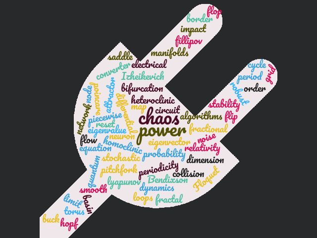

<!--Include the wordcloud image-->

<u><strong></strong></u>

<!--Introductory title and paragraph-->
<h2>About Us</h2>

We work on problems in nonlinear dynamics with applications in various fields ranging from power grid management to relativity. Our lab is led by <a href="leader.html" style="color:#90EE90;">Prof. Soumitro Banerjee</a> and is a part of the <a target="_blank" title="dps-iiserkol" href="https://physics.iiserkol.ac.in/"><em>Department of Physical Sciences</em></a> at <a target="_blank" href="http://www.iiserkol.ac.in/"><em>IISER-Kolkata</em></a>. 

    For more information about ongoing projects please visit our <a href="research.html"><em>Research</em></a> or <a href="leader.html"><em>People</em></a> page.  For updates about talks, conferences and publications, please click on the link below: 
    

<!--Create hover box with news items-->


